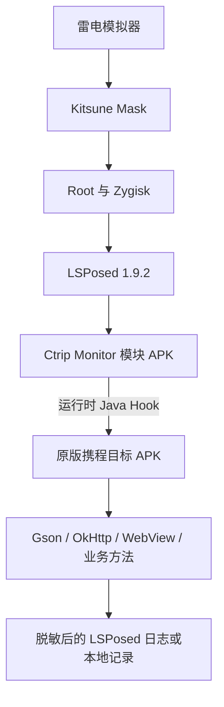
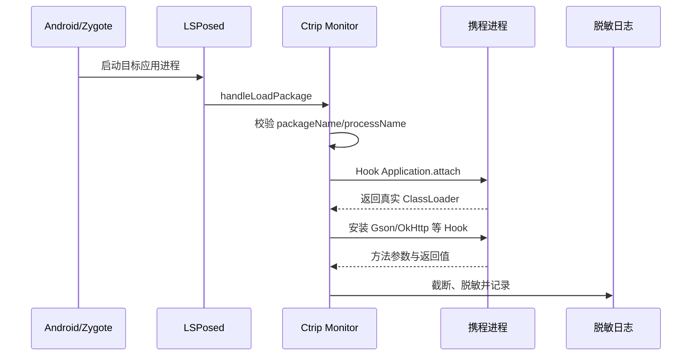

# 携程 Android 运行时数据监听模块

本工程是一个独立的 Java LSPosed 模块，用于在雷电模拟器中观察指定携程 APK 运行过程中的 Java 层数据。模块不解包、不修改、不重签名目标 APK。

> 当前工程处于基础观察阶段：已经具备 LSPosed 入口、目标进程过滤、Gson 监听、OkHttp 请求方法/URL 监听、WebView URL/脚本入口监听，以及 Activity Intent/Bundle 和 SharedPreferences 写入监听；尚未针对目标 APK 的具体混淆类、业务方法、响应模型和 native 方法做定点 Hook。

## 项目背景

本项目的运行环境是经过 Root、Zygisk 和 LSPosed 配置的雷电 Android 模拟器。用户已经在模拟器内使用或安装以下组件：

| 组件 | 在本项目中的定位 |
| --- | --- |
| `kitsuneMask.apk` | 提供 Magisk 兼容的 Root 管理与 Zygisk 环境 |
| `LSPosed-v1.9.2-7024-zygisk-release.zip` | 将本工程的 Hook 代码加载到目标应用进程 |
| `Xposed+Checker.apk` | 检查 Xposed/LSPosed 框架是否正常工作 |
| `设备信息查看器.apk` | 查看模拟器设备、系统和硬件标识信息 |
| `微霸2026_ProMax_26.2.15.apk` | 已安装的模拟器环境改装组件；具体作用以实际配置为准 |
| `隐藏应用列表_3.6.1.r462.4524dde.apk` | 管理或隐藏应用列表相关环境信息 |
| `应用列表检测器_2.4.apk` | 检查应用能够发现的已安装应用列表 |

需要观察的目标安装包是：

```text
64_Ctrip_V8.94.6_SIT4.4_product_Product_30073504_55554007.apk
```

目标是通过 Java 代码监听该应用运行过程中的数据流，包括但不限于：

- Java 对象与 JSON 之间的序列化、反序列化数据；
- HTTP 请求的方法、URL，以及后续定位到的请求体和响应对象；
- 页面、ViewModel、Repository、Retrofit Service 之间传递的业务对象；
- WebView URL、JavaScript Bridge 及其交互参数；
- 必要时的 Intent、Bundle、SharedPreferences 和 SQLite 数据；
- Java 与 JNI/native 之间的方法参数和返回值。

本工程只用于隔离测试环境中的运行时观察。日志设计应对账号凭证、Cookie、Authorization、手机号、证件号和订单个人信息进行脱敏，避免把真实敏感数据写入普通日志。

## 为什么需要独立工程

Kitsune Mask 和 LSPosed 只提供运行环境与 Hook 加载能力，并不包含针对携程业务的监听逻辑。因此需要单独开发本工程，并将其编译为一个 LSPosed 模块 APK。

各部分职责如下：



- **雷电模拟器**：承载隔离的 Android 测试环境。
- **Kitsune Mask**：提供 Root 管理和 Zygisk 基础能力。
- **LSPosed**：在目标进程启动时加载 Hook 模块。
- **本工程**：包含实际 Java Hook 规则、目标包过滤和日志逻辑。
- **目标携程 APK**：保持原始安装包不变，仅在运行时被观察。
- **jadx/apktool 等工具**：仅用于离线定位类名、方法名、依赖和 native 入口，不是模块运行时依赖。

## 技术架构

模块入口实现 `IXposedHookLoadPackage`。当 LSPosed 加载应用包时，入口首先检查包名，只对目标携程应用继续执行。随后 Hook `Application.attach(Context)`，取得目标应用实际使用的 `ClassLoader`，再安装各层监听器。



### 数据监听层次

推荐从上到下逐层定位，不进行全量方法 Hook：

| 优先级 | 层次 | 观察内容 | 当前状态 |
| --- | --- | --- | --- |
| 1 | Gson | JSON 输入、输出及 Java 模型 | 已加入基础 Hook |
| 2 | OkHttp | 请求方法和 URL | 已加入基础 Hook |
| 3 | 业务方法 | Request Bean、Response Bean、Repository 回调 | 等待 jadx 定位 |
| 4 | WebView/JSBridge | H5 URL、桥接类和交互参数 | 已加入 WebView 基础 Hook；JSBridge 等待 jadx 定位 |
| 5 | Intent/本地存储 | 页面参数、配置和缓存 | 已加入 Activity Intent/Bundle 与 SharedPreferences 写入 Hook |
| 6 | JNI/native | Java/native 边界参数和返回值 | Java 层不足时再分析 |

当前 OkHttp Hook 不主动读取 `ResponseBody.string()`，因为响应体通常只能消费一次。后续响应监听应优先 Hook 反序列化方法或业务回调；确需从 OkHttp 层观察时，应使用受大小限制的 `peekBody()` 或无副作用的拦截器。

### 目标包与多进程

源码当前把目标包名设置为：

```text
ctrip.android.view
```

该值必须以目标 SIT APK 的 Manifest 为准。通过以下命令确认：

```powershell
aapt dump badging "64_Ctrip_V8.94.6_SIT4.4_product_Product_30073504_55554007.apk"
```

如果输出的包名不同，需要修改：

```text
app/src/main/java/com/jpz/ctripmonitor/CtripHook.java
```

携程应用可能使用主进程及 `:web`、`:push` 或其他子进程。模块会记录 `packageName` 和 `processName`，后续应根据实际日志判断网络、H5 和业务逻辑分别运行在哪个进程。

## 工程结构

```text
01ctrip-monitor-module/
├── app/
│   ├── build.gradle
│   └── src/main/
│       ├── AndroidManifest.xml
│       ├── assets/xposed_init
│       ├── java/com/jpz/ctripmonitor/CtripHook.java
│       └── res/values/styles.xml
├── build.gradle
├── gradle.properties
├── settings.gradle
└── README.md
```

核心文件说明：

- `CtripHook.java`：模块入口、目标包过滤、ClassLoader 获取和监听器安装。
- `xposed_init`：声明 LSPosed/Xposed 入口类。
- `AndroidManifest.xml`：声明模块身份、描述和最低 Xposed API。
- `app/build.gradle`：Android 应用模块及 Xposed API 的 `compileOnly` 依赖。

## 当前实现

模块目前执行以下行为：

1. 仅当 `packageName` 命中 `TARGET_PACKAGES` 时运行。
2. 输出当前目标包名和进程名。
3. 在 `Application.attach()` 之后取得真实 `ClassLoader`。
4. 尝试 Hook `com.google.gson.Gson.toJson()`。
5. 尝试 Hook `com.google.gson.Gson.fromJson()`。
6. 尝试 Hook `okhttp3.Request.Builder.build()`，记录 HTTP 方法和 URL。
7. 尝试 Hook `android.webkit.WebView.loadUrl()`、`postUrl()`、`loadDataWithBaseURL()` 和 `evaluateJavascript()`，记录 H5 URL 和脚本入口。
8. 尝试 Hook `android.app.Activity.onCreate()` 和 `onNewIntent()`，记录页面类名、Intent URI 和 Bundle 参数。
9. 尝试 Hook `SharedPreferencesImpl.EditorImpl` 的常见写入方法，记录配置和缓存键值变化。
10. 对 HTTP、WebView 和 SharedPreferences 日志进行降噪：过滤静态资源、埋点 gif 和短时间重复项，只保留业务接口、H5 入口和定位类配置键。
11. 对日志进行统一脱敏和长度截断，降低敏感信息与超长内容直接冲击 LSPosed 日志的风险。

如果目标应用对 Gson 或 OkHttp 进行了重打包、混淆，基础 Hook 会记录 `unavailable`，此时需要使用 jadx 根据字符串、调用关系和类结构找出实际类名，再增加精确 Hook。

## 构建前提

当前初始化环境只检测到 Java 11，尚未检测到 Android SDK、Gradle 和 ADB。构建机器需要：

| 工具 | 建议配置 | 用途 |
| --- | --- | --- |
| JDK | 11 | 运行当前 Android Gradle Plugin |
| Android SDK Platform | 33 | 编译 Android 模块 |
| Android Build Tools | 与 Platform 33 配套 | 生成 APK |
| Gradle | 7.5、7.6 或 Wrapper 7.6.4 | 执行构建 |
| ADB | Android SDK Platform Tools | 安装模块和读取日志 |

本工程使用 Android Gradle Plugin `7.4.2`、Java 11、`compileSdk 33`、`minSdk 24`，Xposed API 使用 `compileOnly 'de.robv.android.xposed:api:82'`。Xposed API 不会被打包进最终模块 APK，而由运行环境提供。

生成 Gradle Wrapper：

```powershell
gradle wrapper --gradle-version 7.6.4
```

构建 Debug APK：

```powershell
.\gradlew.bat :app:assembleDebug
```

生成文件位置：

```text
app\build\outputs\apk\debug\app-debug.apk
```

## 安装和启用

安装模块：

```powershell
adb install -r app\build\outputs\apk\debug\app-debug.apk
```

随后在模拟器中执行：

1. 打开 LSPosed 管理界面。
2. 启用 `Ctrip Monitor` 模块。
3. 模块作用域只勾选目标携程应用，不勾选 Android 系统框架。
4. 强制停止目标携程应用。
5. 重新启动目标应用并执行需要观察的业务流程。
6. 在 LSPosed 模块日志中查找 `CtripMonitor`。

修改 Hook 代码、目标包名或 LSPosed 作用域后，都应重新构建并安装模块，然后强制停止、重新启动目标应用进程。

## 后续分析路径

完成基础日志采样后，后续按以下路径推进：

```text
基础 Gson/OkHttp 日志
    -> 从 JSON 字段和调用栈识别业务场景
    -> 使用 jadx 搜索字段、模型和 Retrofit 接口
    -> 定位 Request/Response/Repository 方法
    -> 用精确 Hook 替换高频通用 Hook
    -> Java 数据仍不可见时定位 native/JNI 边界
```

建议优先记录一次完整业务操作的时间线，包括点击动作、页面变化、日志时间和请求 URL。这样可以把大量后台请求与目标业务请求区分开。

## 已知限制

- 当前机器已使用 `D:\Program Files\.android\download` 内的离线包配置 Android SDK，并通过 `aapt2 + javac + d8 + apksigner` 手工生成 Debug APK。
- SIT APK 的真实包名尚未通过其 Manifest 验证。
- 当前没有读取 HTTP 请求体和响应体。
- 当前没有实现具体业务 JSBridge、SQLite 或 JNI Hook。
- 标准 Gradle 构建仍受限于本机无法连接 `services.gradle.org` 下载 Gradle 7.6.4 分发包；`gradle/wrapper/gradle-wrapper.properties` 已把 `networkTimeout` 调整为 60000。
- 目标版本升级后，混淆类名、方法签名和依赖版本可能变化，需要重新定位 Hook 点。
- LSPosed 作用域配置错误、目标运行在未覆盖的子进程或类由其他 ClassLoader 加载，都会导致 Hook 不生效。

## 非目标范围

本工程不执行以下操作：

- 不修改、重打包或重新签名目标携程 APK；
- 不向目标 APK 注入 Frida Gadget；
- 不修改目标方法的参数或返回值；
- 不绕过服务端权限控制；
- 不将敏感账号、支付或个人信息原样持久化。

如果将来需要临时验证 Hook 点，可以独立使用 Frida 做动态试验；确认类和方法后，再把稳定的只读监听逻辑迁移到本 LSPosed 模块中。
## PCAP 离线解析命令

当通过抓包方式拿到携程酒店业务流量后，可以使用 `02ctrip-pcap-reverse` 中的 Python 复刻脚本离线解析 SOTP 帧，并输出嵌入的 JSON 文档。

示例命令：

```powershell
python 02ctrip-pcap-reverse\pcap_hotel_parser.py 02ctrip-pcap-reverse\work\ctrip_hotel_20260806_211621.pcap -o 02ctrip-pcap-reverse\work\ctrip_hotel_20260806_211621.json
```

脚本会按 TCP stream 重组 SOTP 数据，处理 XOR、GZIP、Zstd 压缩，再扫描 payload 中的 JSON 对象或数组。若遇到无法解压的单帧，会输出 warning 并跳过该帧，已成功解码的 JSON 会继续写入输出文件。
