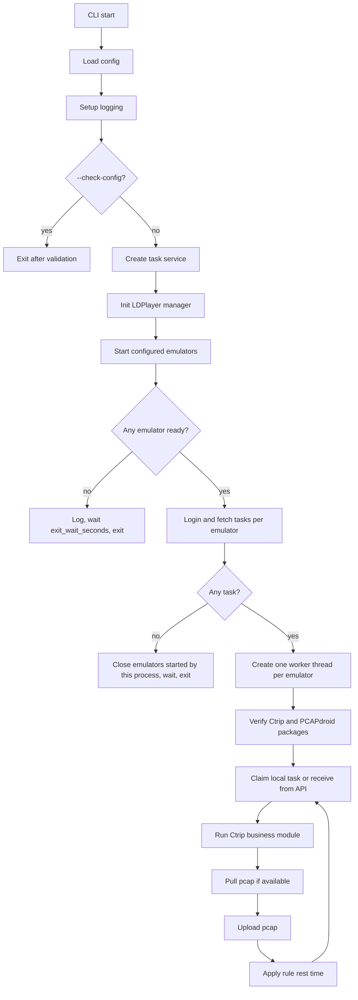

# 03ctrip-ldauto v1 design

This document is the implementation guide for `03ctrip-ldauto`. The current
code follows the configuration shape in `configs/config.example.yaml`.

## V1 objective

V1 provides a runnable automation backbone for LDPlayer + Ctrip + PCAPdroid:

- Load and validate runtime config.
- Write logs to console and `data/logs/`.
- Start configured LDPlayer instances when needed.
- Wait for ADB readiness.
- Login to the task website and persist cookie/task files.
- Run one worker thread per emulator.
- Check Ctrip and PCAPdroid package installation.
- Execute the business-module boundary for Ctrip tasks.
- Save/pull/upload pcap files when PCAPdroid exposes one.

The concrete Ctrip page recognition and coordinate script is the next module
to implement on top of the existing `BusinessModule` boundary.

## Current config contract

The current config has three top-level sections:

```yaml
system:
  exit_wait_seconds: 20
  startup_wait_seconds: 60
  log_level: INFO
  data_dir: data
  app_mode: console

ld:
  ldplayer_path: "D:/Program Files/leidian/LDPlayer14"
  multiplayer_path: "D:/Program Files/leidian/ldmutiplayer/dnmultiplayerex.exe"
  ldconsole_path: ""
  adb_path: ""
  instances:
    - id: ld01
      name: "LDPlayer-2"
      index: 2
      launch_by: index
      adb_serial: "emulator-5558"
  wait_device_ready_seconds: 90
  wait_app_ready_seconds: 15
  diagnostic_running_wait_seconds: 60
  diagnostic_adb_wait_seconds: 15

xc:
  app:
    packages:
      ctrip: "ctrip.android.view"
      pcapdroid: "com.emanuelef.remote_capture"
  task:
    site_name: example
    base_url: "https://example.com"
    username: "account"
    password: "password"
    login_path: "/api/login"
    city_path: "/api/cities"
    task_path: "/api/tasks"
    receive_task_path: "/api/tasks/receive"
    upload_pcap_path: "/api/pcap/upload"
    request_timeout_seconds: 20
  rule:
    - name: normal
      batch_rest_seconds: 300
      task_rest_seconds: 30
      browse_seconds: 20
      empty_task_retry_seconds: 60
      max_task_retry: 3
      instance_ids:
        - ld01
```

## Config section responsibilities

| Section | Purpose | Implemented by |
| --- | --- | --- |
| `system` | Process behavior, data directory, logs, exit wait | `config.models.SystemConfig`, `log.setup` |
| `ld` | LDPlayer path, multiplayer path, ADB path, emulator instances | `ld.ldconsole`, `ld.manager`, `ld.adb` |
| `xc.app` | Business app package names | `business.ctrip`, `business.pcapdroid` |
| `xc.task` | Task website endpoints and credentials | `task.client`, `task.service` |
| `xc.rule` | Per-instance strategy values | `strategy.selector`, `scheduler.runner` |

`configs/config.yaml` is the local runtime file. If it does not exist, the
loader falls back to `configs/config.example.yaml`.

Environment overrides:

| Environment variable | Replaces |
| --- | --- |
| `CTRIP_LDAUTO_BASE_URL` | `xc.task.base_url` |
| `CTRIP_LDAUTO_USERNAME` | `xc.task.username` |
| `CTRIP_LDAUTO_PASSWORD` | `xc.task.password` |

## Runtime flow



## Module layout

```text
src/ctrip_ldauto/
  __main__.py              CLI entry
  app.py                   application orchestration
  config/
    loader.py              YAML loading and validation
    models.py              dataclass config models
  log/
    setup.py               console + file logging
  ld/
    ldconsole.py           ldconsole.exe wrapper
    adb.py                 ADB wrapper
    device.py              emulator device model
    manager.py             start/close configured emulators
  task/
    client.py              HTTP task API client
    storage.py             cookie/task local state files
    service.py             task workflow facade
  strategy/
    selector.py            rule selection by instance id
  business/
    base.py                replaceable business interface
    ctrip.py               Ctrip business module
    pcapdroid.py           PCAPdroid capture helper
  scheduler/
    runner.py              per-emulator worker threads
```

## Data files

Runtime data is written under `system.data_dir`.

```text
data/
  logs/
    ldauto_yyyyMMdd.log
  pcap/
    yyyyMMdd/
      <emulator_id>/
        <pcap-file>
  <site_name>/
    ck_yyyyMMdd_<emulator_id>.txt
    task_yyyyMMdd_<emulator_id>.txt
```

Task files use JSON Lines with this shape:

```json
{
  "_local_id": "task-id",
  "status": "new",
  "retry": 0,
  "task": {
    "hotel_name": "example hotel"
  }
}
```

Supported statuses:

| Status | Meaning |
| --- | --- |
| `new` | Stored locally and not yet claimed |
| `claimed` | Claimed by one emulator worker |
| `running` | Business module is executing |
| `pcap_saved` | PCAP file was pulled locally |
| `uploaded` | PCAP upload succeeded |
| `pcap_missing` | Business flow finished but no PCAP file was found |
| `failed` | Execution or upload failed |

## LDPlayer module behavior

`ld.manager.EmulatorManager` owns LDPlayer lifecycle:

1. Resolve `ldconsole.exe` from `ld.ldconsole_path`, then `ld.ldplayer_path`,
   then `ld.multiplayer_path` by reading `pathconfig.ini`, then common
   LDPlayer install paths.
2. Resolve `adb.exe` from `ld.adb_path`, then LDPlayer directory.
3. For each configured instance, call `isrunning`.
4. Already-running instances are reused and not closed by this process.
5. Stopped instances are launched with `ldconsole launch --index <index>` or
   `ldconsole launch --name <name>`, based on `ld.instances[].launch_by`.
6. ADB serial is read from `ld.instances[].adb_serial` when configured,
   otherwise through `ldconsole adb --command get-serialno`, with
   `emulator-{5554 + index * 2}` as fallback.
7. ADB readiness is checked with `adb shell echo ok`.

Instance fields:

| Field | Required | Purpose |
| --- | --- | --- |
| `id` | yes | Stable logical id used by task files and rules |
| `index` | yes | LDPlayer instance index from `ldconsole list2` |
| `name` | yes | Human-readable label; exact LDPlayer name only matters when `launch_by=name` |
| `launch_by` | no | `index` by default; use `name` only when the real instance name is stable |
| `adb_serial` | no | Explicit ADB serial override for nonstandard LDPlayer ports |

## LDPlayer diagnostics

Use `--check-ld` to validate every configured `ld.instances` item against the
real multiplayer instance list.

```powershell
python -m ctrip_ldauto --check-ld
```

Useful diagnostic variants:

```powershell
python -m ctrip_ldauto --check-ld --no-start-ld
python -m ctrip_ldauto --check-ld --ld-running-wait-seconds 20 --ld-adb-wait-seconds 15
python -m ctrip_ldauto --check-ld --keep-started-ld
```

The diagnostic reports:

- whether the configured index exists in `ldconsole list2`;
- whether the instance was already running;
- whether launch entered a stable running state;
- which ADB serial was selected;
- whether ADB became ready;
- whether Ctrip and PCAPdroid packages are installed;
- suggested config changes such as `launch_by=index` or `adb_serial`.

## Task API behavior

`task.client.TaskApiClient` uses these endpoint conventions:

| Operation | Method | Config path | Request shape |
| --- | --- | --- | --- |
| Login | `POST` | `xc.task.login_path` | `{"username": "...", "password": "..."}` |
| Cities | `GET` | `xc.task.city_path` | no body |
| Tasks | `GET` | `xc.task.task_path` | optional `city_id` query |
| Receive | `POST` | `xc.task.receive_task_path` | `{"emulator_id": "ld01"}` |
| Upload pcap | `POST multipart` | `xc.task.upload_pcap_path` | `task_id`, `emulator_id`, `file` |

The response parser accepts common list envelopes such as `tasks`, `cities`,
`data`, or `items`.

## Business module boundary

Business modules implement:

```python
class BusinessModule:
    name: str

    def verify_environment(self, device) -> None:
        ...

    def run_task(self, device, task_record, rule) -> BusinessResult:
        ...
```

This boundary allows the current Ctrip module to be replaced later without
changing LDPlayer, task, strategy, or scheduler code.

Current Ctrip v1 behavior:

1. Verify Ctrip package exists.
2. Verify PCAPdroid package exists.
3. Open PCAPdroid.
4. Open Ctrip.
5. Enter the Ctrip hotel automation boundary.
6. Sleep for `rule.browse_seconds`.
7. Return/back once.
8. Open PCAPdroid and search for the latest `.pcap` or `.pcapng` file under
   common SD card directories.
9. Pull the file to `data/pcap/yyyyMMdd/<emulator_id>/`.
10. Let the task module upload it.

The next business implementation should fill the Ctrip page actions:

- Enter hotel page.
- Select check-in/check-out date.
- Input hotel name.
- Click search.
- Wait for hotel list.
- Match hotel name.
- Handle empty result or no matched hotel.
- Enter detail page.
- Return to list for the next task.

## Command line

Validate config:

```powershell
python -m ctrip_ldauto --check-config
```

Validate LDPlayer instances:

```powershell
python -m ctrip_ldauto --check-ld --no-start-ld
python -m ctrip_ldauto --check-ld --ld-running-wait-seconds 20 --ld-adb-wait-seconds 15
```

Run with a local config:

```powershell
python -m ctrip_ldauto --config configs\config.yaml
```

When running without package installation:

```powershell
python -c "import sys; sys.path.insert(0, r'src'); from ctrip_ldauto.__main__ import main; raise SystemExit(main(['--check-config']))"
```

## Implementation checkpoints

V1 code follows this document:

- `config.loader` parses the new `xc` shape.
- `strategy.selector` chooses a rule from `xc.rule` by `instance_ids`.
- `business.ctrip` reads packages from `xc.app.packages`.
- `task.client` reads endpoints from `xc.task`.
- `scheduler.runner` runs one worker per started emulator.

Before extending the Ctrip page logic, run:

```powershell
python -m compileall src
python -m ctrip_ldauto --check-config
```
