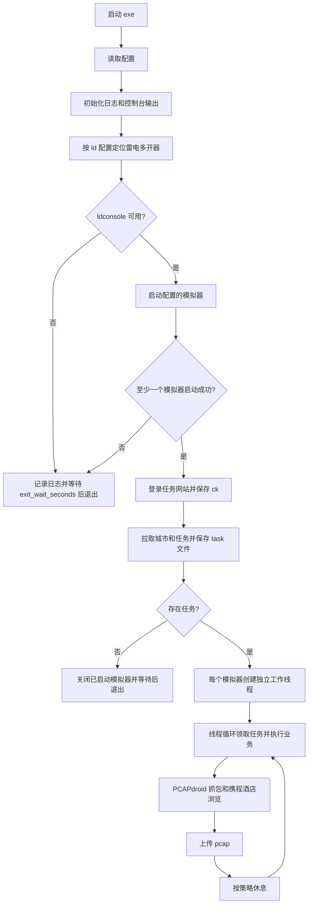
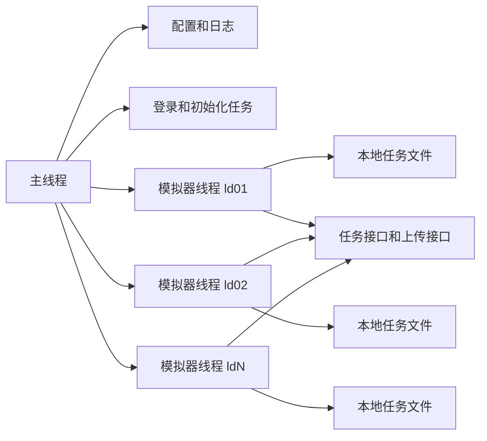

# 携程雷电模拟器自动化系统设计

## 目标和边界

本工程用于在 Windows 环境下通过雷电模拟器自动操作携程 App，完成酒店任务领取、App 搜索浏览、PCAPdroid 抓包、pcap 文件上传和按策略循环调度。

当前阶段先完成可落地的工程设计，后续按本文档的模块清单逐个实现。

正式工程不复用 `work/ldscript-automation` 的 Web 面板、拖拽脚本编辑器和通用流水线能力，只参考它的核心雷电控制实现：

- `auto_ld/emulator/ldplayer.py`：`ldconsole.exe` 启动、关闭、状态查询、实例列表、ADB serial 推导。
- `auto_ld/controller/adb.py`：ADB 连接检查、截图、点击、滑动、返回、主页、文本输入、启动/停止 App、包名搜索。
- `auto_ld/controller/packages.py`：应用包名记录思路。

## 技术栈

| 项目 | 选择 |
| --- | --- |
| 语言 | Python 3.11+ |
| 环境管理 | venv |
| 配置格式 | YAML |
| HTTP 客户端 | requests 或 httpx |
| 并发模型 | 每个模拟器一个线程，主线程负责调度和退出控制 |
| 日志 | logging，控制台和 `data/logs/` 双输出 |
| 打包 | PyInstaller 生成 exe |
| UI | 第一阶段使用命令窗口控制台输出；后续可接入轻量控制界面 |

## 目录规划

```text
03ctrip-ldauto/
  README.md
  docs/
    design.md
  pyproject.toml
  requirements.txt
  configs/
    config.example.yaml
  data/
    logs/
    pcap/
    <site>/
      ck_yyyyMMdd_<emulator_id>.txt
      task_yyyyMMdd_<emulator_id>.txt
  src/
    ctrip_ldauto/
      __main__.py
      app.py
      config/
      logging/
      ld/
      task/
      business/
      scheduler/
      storage/
      strategy/
```

`work/` 是工作临时目录，不参与正式包结构。

## 配置文件设计

配置文件包含四个一级模块：系统模块、雷电模块、任务模块、策略模块。

```yaml
system:
  exit_wait_seconds: 20
  startup_wait_seconds: 60
  log_level: INFO
  data_dir: data
  app_mode: console

ld:
  ldplayer_path: "D:/leidian/LDPlayer9"
  ldconsole_path: ""
  adb_path: ""
  instances:
    - id: ld01
      name: "雷电模拟器-1"
      index: 0
    - id: ld02
      name: "雷电模拟器-2"
      index: 1
  packages:
    ctrip: "ctrip.android.view"
    pcapdroid: "com.emanuelef.remote_capture"
  wait_device_ready_seconds: 90
  wait_app_ready_seconds: 15

task:
  site_name: example
  base_url: "https://example.com"
  username: "account"
  password: "password"
  login_path: "/api/login"
  city_path: "/api/cities"
  task_path: "/api/tasks"
  receive_task_path: "/api/tasks/receive"
  upload_pcap_path: "/api/pcap/upload"
  request_timeout_seconds: 20

strategy:
  batch_rest_seconds: 300
  task_rest_seconds: 30
  browse_seconds: 20
  empty_task_retry_seconds: 60
  max_task_retry: 3
```

敏感配置后续可以支持 `.env` 覆盖，例如账号、密码、接口地址。

## 总体流程



## 模块职责

### 系统调度模块

负责进程生命周期、配置加载、日志初始化、启动失败退出等待、线程创建、线程回收和全局停止信号。

关键职责：

- 运行 exe 后启动命令窗口输出。
- 读取 YAML 配置并校验四个一级模块。
- 将日志同时输出到控制台和 `data/logs/ldauto_yyyyMMdd.log`。
- 统一执行 `exit_wait_seconds` 后退出。
- 启动成功的模拟器需要在无任务或异常退出时按策略关闭。
- 捕获 Ctrl+C，通知所有模拟器线程停止，停止 PCAPdroid 抓包并关闭模拟器。

### 雷电模块

负责雷电模拟器和 ADB 的核心控制。实现时参考 `work/ldscript-automation`，只保留核心操作。

关键能力：

- 定位 `ldconsole.exe` 和 `adb.exe`。
- 读取配置中的模拟器名称或 index。
- 查询实例是否存在。
- 查询实例是否已运行，已运行则跳过启动。
- 启动实例并等待 ADB ready。
- 关闭实例。
- 获取实例 serial。
- 检查应用是否安装。
- 启动/停止 App。
- 点击、滑动、返回、主页、输入文本、截图。
- 等待界面条件：通过截图模板、OCR 或坐标状态判断。

雷电启动规则：

1. 先校验 `ldconsole.exe` 可执行。
2. 对配置的每个实例查询运行状态。
3. 已运行实例标记为 `already_running`，不重复启动。
4. 未运行实例调用 `ldconsole launch --index <index>`。
5. 等待 `ldconsole isrunning` 和 ADB `shell echo ok` 同时可用。
6. 单个实例失败时记录错误；所有实例失败时等待后退出。

### 任务模块

负责网站登录、cookie 保存、城市接口、任务接口、任务领取、任务文件读写、任务状态标记和 pcap 上传。

数据文件：

| 文件 | 内容 |
| --- | --- |
| `data/<site>/ck_yyyyMMdd_<emulator_id>.txt` | 当前登录 cookie 或 token |
| `data/<site>/task_yyyyMMdd_<emulator_id>.txt` | 当前模拟器任务队列和任务状态 |

任务状态建议：

| 状态 | 含义 |
| --- | --- |
| `new` | 已拉取未执行 |
| `claimed` | 已被某模拟器线程领取 |
| `running` | 正在执行 |
| `pcap_saved` | 已保存 pcap |
| `uploaded` | 已上传 |
| `failed` | 执行失败 |
| `no_hotel` | 搜索后没有酒店或未匹配到酒店 |

任务领取规则：

1. 线程先从本地 `task_yyyyMMdd_<emulator_id>.txt` 读取一条 `new` 任务。
2. 读取成功后原子标记为 `claimed`，避免同一线程重复处理。
3. 本地无任务时调用领取接口。
4. 领取接口返回任务后写入本地文件，再重复本地读取逻辑。
5. 接口无任务时按 `strategy.empty_task_retry_seconds` 等待后重试。

### 携程业务模块

负责具体 App 操作流程。后续该模块会替换成其他业务模块，因此必须通过统一接口接入系统调度。

建议接口：

```python
class BusinessModule:
    name: str

    def verify_environment(self, device) -> None:
        """检查目标业务 App 和辅助 App 是否安装。"""

    def run_task(self, device, task, capture) -> dict:
        """执行一条业务任务，返回执行结果和 pcap 路径。"""
```

携程当前业务流程：

1. 检查携程 App 和 PCAPdroid 是否安装。
2. 打开 PCAPdroid。
3. 打开携程 App。
4. 进入酒店页面。
5. 选择入住日期和离店日期。
6. 输入酒店名称。
7. 点击搜索。
8. 等待酒店列表出现。
9. 对比酒店名称。
10. 找到目标酒店后切换到 PCAPdroid，点击开始抓包。
11. 切回携程 App，进入酒店详情。
12. 浏览 `strategy.browse_seconds`。
13. 返回酒店列表。
14. 如果该模拟器还有下一条任务，继续在列表页改日期和酒店名搜索。
15. 如果没有下一条任务，切回 PCAPdroid，点击停止并保存 pcap。
16. 返回 pcap 路径给任务模块上传。

必须预留的异常分支：

- 搜索按钮点击后列表未出现。
- 搜索结果为空。
- 列表出现但酒店名称不匹配。
- App 弹窗遮挡。
- PCAPdroid 开始或停止按钮未点击成功。
- pcap 文件未生成。
- App 崩溃或 ADB 断开。

### 策略模块

负责节奏控制和休息时间，不直接操作模拟器。

策略字段：

- 每一批次任务休息多少秒：`batch_rest_seconds`
- 每一个任务休息多少秒：`task_rest_seconds`
- 浏览酒店详情多少秒：`browse_seconds`
- 空任务重试间隔：`empty_task_retry_seconds`
- 单任务最大重试：`max_task_retry`

策略模块只返回决策结果，例如 `sleep_seconds`、`should_retry`、`should_stop_batch`。

## 线程模型



每个模拟器线程只操作自己的模拟器和自己的任务文件，减少锁竞争。共享的只有全局停止信号、日志和任务接口。

## PCAP 文件处理

PCAPdroid 保存文件后，雷电模块通过 ADB 查找最新文件并 pull 到本地：

```text
data/pcap/yyyyMMdd/<emulator_id>/<task_id>.pcap
```

上传成功后，任务状态更新为 `uploaded`。上传失败时保留本地 pcap，任务状态更新为 `pcap_saved` 或 `failed`，后续可以实现补传命令。

## 日志规范

日志同时输出到控制台和文件：

```text
data/logs/ldauto_yyyyMMdd.log
```

建议格式：

```text
2026-08-06 22:30:00 INFO [main] 读取配置完成
2026-08-06 22:30:01 INFO [ld01] 模拟器已运行，跳过启动
2026-08-06 22:30:10 ERROR [ld02] ADB 连接失败: timeout
```

## 第一阶段实现清单

### 1. 工程基础

- 创建 `pyproject.toml`。
- 创建 `requirements.txt`。
- 创建 venv 使用说明。
- 创建 `src/ctrip_ldauto/__main__.py`。
- 创建配置示例 `configs/config.example.yaml`。
- 创建日志模块。

### 2. 配置模块

- 定义 `SystemConfig`、`LdConfig`、`TaskConfig`、`StrategyConfig`。
- YAML 加载。
- 必填字段校验。
- 默认值处理。
- 敏感字段环境变量覆盖。

### 3. 雷电模块

- 封装 `LDConsoleClient`。
- 封装 `AdbDevice`。
- 实现实例列表、状态查询、启动、关闭。
- 实现 ADB ready 检查。
- 实现 App 安装检查。
- 实现基础点击、滑动、返回、输入、截图。

### 4. 任务模块

- 登录接口。
- cookie/token 保存。
- 城市接口。
- 任务接口。
- 领取任务接口。
- 本地任务文件读写和状态标记。
- pcap 上传接口。

### 5. 携程业务模块

- 业务模块接口。
- 携程业务实现。
- 酒店首页进入。
- 日期选择。
- 酒店名称输入。
- 搜索和列表等待。
- 酒店名称匹配。
- 详情页浏览。
- 无酒店和异常分支。

### 6. PCAPdroid 模块

- 打开 PCAPdroid。
- 开始抓包。
- 停止抓包。
- 查找并导出最新 pcap。
- 与任务上传流程串联。

### 7. 系统调度模块

- 主流程编排。
- 每个模拟器一个线程。
- 全部失败退出。
- 无任务退出并关闭已启动模拟器。
- Ctrl+C 优雅停止。
- 策略休眠。

### 8. 打包

- PyInstaller 配置。
- exe 启动入口。
- 配置文件和 data 目录路径兼容。

## 后续实现原则

- 先实现可观测的最小闭环，再补复杂识别能力。
- 每个模块必须有清晰输入、输出和错误类型。
- 携程业务模块不能直接读取全局配置，只接收调度器传入的设备、任务和策略。
- 业务模块替换时，系统调度、雷电模块、任务模块不改或少改。
- 所有失败都必须同时写控制台和 `data/logs/`。
- 涉及任务状态变化时，先写本地状态，再调用外部接口。
