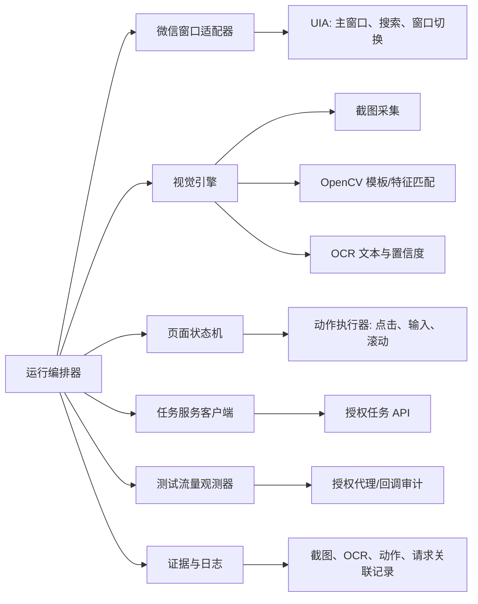
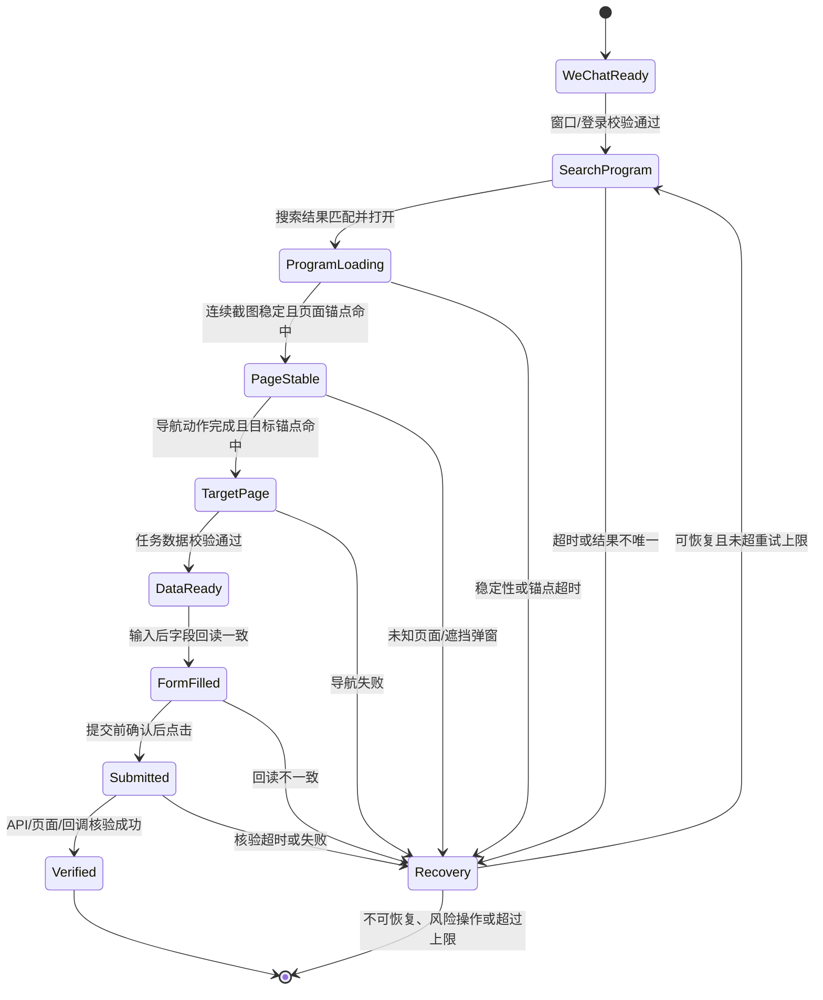

# Windows 微信小程序桌面自动化实施方案

## 目标与边界

本项目在 Windows 10 上驱动**已由人工正常登录**的微信 PC 客户端，搜索并打开指定小程序，然后在可见窗口内完成一组可配置的业务操作。自动化以 Windows UI Automation、窗口截图、图像识别和 OCR 为主，不调用微信私有协议。

首期目标是建立一条稳定、可诊断、可回退的执行链路：

```text
确认微信已登录
  -> 搜索并打开目标小程序
  -> 等待页面稳定并校验
  -> 识别页面状态
  -> 导航至目标页面
  -> 获取授权的任务数据并填入页面字段
  -> 观测授权测试流量并核验结果
  -> 提交任务
  -> 成功归档；失败则回退、重试或停止
```

以下行为不在范围内：

- 自动登录、扫码、读取 Cookie、A16 或微信本地凭据。
- 逆向、伪造或直接调用微信私有协议。
- 绕过 TLS 证书校验、安装未获授权的根证书，或截获第三方账号和服务的数据。
- 无确认地批量提交、支付、删除或修改不可逆业务数据。

“全局代理监听”仅适用于项目所有者控制或明确书面授权的测试服务。生产默认关闭；优先使用测试系统提供的任务查询和回调/审计接口，而不是解密或改写第三方流量。

## 使用场景与前置条件

| 项目 | 要求 |
| --- | --- |
| 操作系统 | Windows 10，推荐固定显示缩放（100% 或 125%）和固定分辨率 |
| 微信 | 已人工登录，主窗口可见；执行期间不锁屏、不最小化 |
| 小程序 | 目标小程序有合法访问权限，页面流程已由业务方确认 |
| 账号 | 使用专用测试账号，具备幂等或可撤销的测试数据 |
| 网络 | 任务接口、观测接口均为项目方控制或授权的环境 |
| 人工确认 | 首次运行、风险操作、异常恢复后恢复执行均需要确认 |

现有仓库已具备 `pywinauto`、`pyautogui`、`mss`、OpenCV 和 PaddleOCR 基础依赖。后续将统一改由 `uv` 管理 Python 版本、虚拟环境和锁定依赖。

## 总体架构



### 模块职责

| 模块 | 职责 | 不负责 |
| --- | --- | --- |
| `wechat_window` | 定位、激活、恢复和验证微信主窗口；通过 UIA 操作可访问控件 | 登录、读取私密认证材料 |
| `mini_program_launcher` | 搜索小程序、选择正确结果、等待容器窗口出现 | 依赖固定坐标盲点点击 |
| `vision` | 截图裁剪、OCR、模板匹配、视觉稳定性判断 | 将低置信度结果直接当作成功 |
| `page_state` | 根据锚点识别页面和弹窗状态，定义合法迁移 | 承担鼠标或键盘细节 |
| `action_executor` | 点击、输入、滚动、等待与提交前确认 | 决定业务规则 |
| `task_client` | 从授权 HTTP API 获取任务、上报幂等结果 | 采集微信或第三方私有请求 |
| `traffic_observer` | 关联自有测试服务的请求 ID、状态码和回调 | 解密或篡改不受控流量 |
| `recovery` | 分类错误、截图取证、回退、限次重试、熔断 | 无限重试 |

## 页面状态机

状态识别不以“延时结束”作为成功条件。每个状态至少有一个强锚点（UIA 控件、唯一文字或高质量模板），并在动作前后重复校验。



### 页面稳定判定

页面加载完成需同时满足以下条件：

1. 在连续 2 至 3 帧截图中，内容区域变化比例低于配置阈值。
2. 目标状态的文字、模板或 UIA 锚点出现，且 OCR 置信度不低于阈值。
3. 加载蒙层、网络错误提示、权限弹窗和升级提示均未出现。

仅满足其中一项时继续等待；到达超时后记录截图、OCR 结果和当前状态候选，进入恢复流程。

## 元素定位策略

定位优先级由稳定性高到低如下：

1. UIA 控件：仅用于微信主窗口、搜索框、结果列表和可访问的窗口层级。
2. 文本锚点：OCR 找到唯一文本后，以文本框中心或相对偏移点击。
3. 模板匹配：按钮图标、固定视觉组件；模板必须按 DPI/主题/版本分组并保存阈值。
4. 相对坐标：只允许作为已验证锚点的局部偏移，禁止作为跨页面的全局坐标。

每个可点击元素定义为一个 locator，包含名称、页面状态、候选策略、最小置信度、点击点、点击后的期望状态和失败截图名称。OCR 存在同名文本或置信度不足时必须拒绝点击，不采用“第一个命中”的策略。

## 任务数据与提交核验

任务服务采用项目方控制的 HTTPS API。客户端应携带专门发放的短期测试令牌，令牌仅从环境变量或本机安全存储读取，绝不写入 `config.json`、日志或截图文件名。

建议最小接口契约：

| 接口 | 方法 | 作用 | 必需字段 |
| --- | --- | --- | --- |
| `/api/tasks/next` | `POST` | 领取一项任务 | `runner_id`、`capabilities` |
| `/api/tasks/{id}/heartbeat` | `POST` | 维持任务租约 | `attempt_id`、`state` |
| `/api/tasks/{id}/result` | `POST` | 上报成功或失败 | `attempt_id`、`status`、`evidence_refs` |
| `/api/runs/{attempt_id}` | `GET` | 查询服务端核验状态 | `attempt_id` |

任务数据必须带 `task_id`、`attempt_id`、过期时间、输入字段白名单、目标页面标识及允许动作。提交使用 `attempt_id` 作为幂等键；网络重试不应造成重复提交。

任务完成至少满足两项独立证据：页面成功锚点、任务 API 返回完成状态、或自有测试服务回调。流量观测器只记录允许域名的时间、请求 ID、方法、状态码、关联 ID 和摘要；默认不保存请求/响应正文。如确需采样正文，须在测试环境启用字段脱敏和最短保留期。

## 失败处理与停止策略

| 类型 | 例子 | 动作 |
| --- | --- | --- |
| 短暂 | 页面尚未刷新、OCR 一次未命中 | 指数退避重试，最多 3 次 |
| 可恢复 | 搜索结果错位、弹窗遮挡、页面漂移 | 截图后返回已知页面，再从最近检查点执行 |
| 需人工处理 | 微信未登录、窗口被锁定、验证码、权限确认 | 停止当前任务并通知人工 |
| 不可继续 | 任务过期、数据不合法、提交结果冲突 | 停止并将证据上报任务服务 |

重试必须限定在无副作用或幂等的步骤。点击“提交”后只允许执行状态查询和幂等结果上报，禁止再次点击，除非服务端明确确认上一次未受理。

## 目录与配置演进

建议在保持当前 `main.py` 可运行的前提下逐步整理为：

```text
src/wxpc_xcxauto/
  app.py                 # 编排入口
  adapters/              # 微信 UIA、鼠标键盘、截图
  vision/                # OCR、模板、稳定性判定
  workflow/              # 状态机、locator、动作定义
  services/              # 任务 API 与授权流量观测
  observability/         # 日志、截图、脱敏证据
configs/
  example.json
templates/
  <program>/<dpi>/
artifacts/
  runs/<attempt_id>/
tests/
docs/
```

配置分为三类：可提交的 `configs/example.json`、本地忽略的 `config.json`、仅由环境变量提供的敏感配置。所有等待时间、OCR 阈值、匹配阈值、重试次数和允许域名都必须可配置。

推荐配置骨架：

```json
{
  "wechat": {
    "window_title": "微信",
    "expected_login_anchor": "通讯录"
  },
  "mini_program": {
    "name": "目标小程序",
    "entry_anchor": "首页"
  },
  "execution": {
    "default_timeout_seconds": 15,
    "max_retries": 3,
    "require_submit_confirmation": true
  },
  "vision": {
    "ocr_min_confidence": 0.85,
    "template_min_score": 0.9,
    "stable_frame_count": 3
  },
  "traffic_observation": {
    "enabled": false,
    "allowed_hosts": ["test-api.example.internal"],
    "store_bodies": false
  }
}
```

## 使用 uv 管理环境

项目将使用 `uv` 替代手工创建虚拟环境和直接 `pip install`。初始化后，依赖与 Python 版本应记录在 `pyproject.toml` 和 `uv.lock`，提交到仓库；`.venv` 不提交。

```powershell
uv venv --python 3.11
uv add pywinauto pywin32 pyautogui mss Pillow opencv-python paddleocr paddlepaddle
uv run python main.py --config config.json
```

建议先在一台固定规格的 Windows 10 测试机完成 PaddleOCR、OpenCV 和 UIA 兼容性验证，再锁定可复现的版本。若 PaddlePaddle 在目标机器上需要特定 wheel，应将额外索引和平台说明写入项目配置，不在运行脚本中临时下载。

## 实施顺序与验收标准

1. 基础窗口阶段：发现已登录微信、前台激活、窗口尺寸/DPI 记录；无法确认登录时安全退出。
2. 启动阶段：搜索并打开唯一匹配的小程序，验证小程序容器和首页锚点。
3. 视觉阶段：建立 locator、截图留存、OCR/模板置信度阈值和页面稳定判定。
4. 工作流阶段：实现显式状态机、检查点、回退路径与单步 dry-run。
5. 数据阶段：接入授权任务 API、输入字段回读、提交幂等和结果核验。
6. 观测阶段：仅在测试环境接入允许域名的代理/回调关联，完成脱敏和留存策略。
7. 稳定性阶段：在不同 DPI、微信版本和异常弹窗场景下回归，形成模板版本矩阵。

首个可验收版本应完成以下测试：

- 连续 20 次从已登录微信打开目标小程序，成功率达到约定目标，且每次都有页面锚点证据。
- 人为注入网络慢、遮挡弹窗、窗口失焦、OCR 未命中等故障，系统能在限定次数内回退或安全停止。
- 相同 `attempt_id` 的重复运行不会重复提交任务。
- 日志、截图、接口观测记录不包含访问令牌、原始敏感字段或非允许域名流量。

## 运行证据与排障

每次运行保存到 `artifacts/runs/<attempt_id>/`，至少包括：结构化事件日志、关键状态截图、OCR/模板候选与置信度、动作前后状态、任务 API 关联 ID、失败原因和重试轨迹。截图和文本输出须先脱敏；证据保留周期由测试环境数据规范决定。

排障按“窗口存在 -> 登录锚点 -> 小程序入口 -> 页面锚点 -> 数据契约 -> 提交核验”的顺序进行。这样能区分 UI 版本变化、视觉定位问题、任务数据错误和服务端结果不一致，避免将单一超时误判为业务失败。
