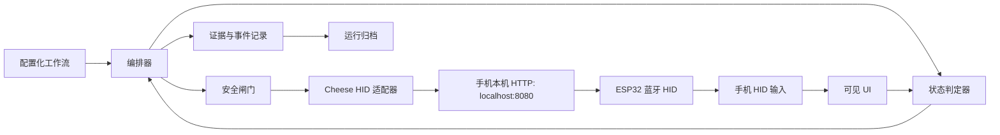
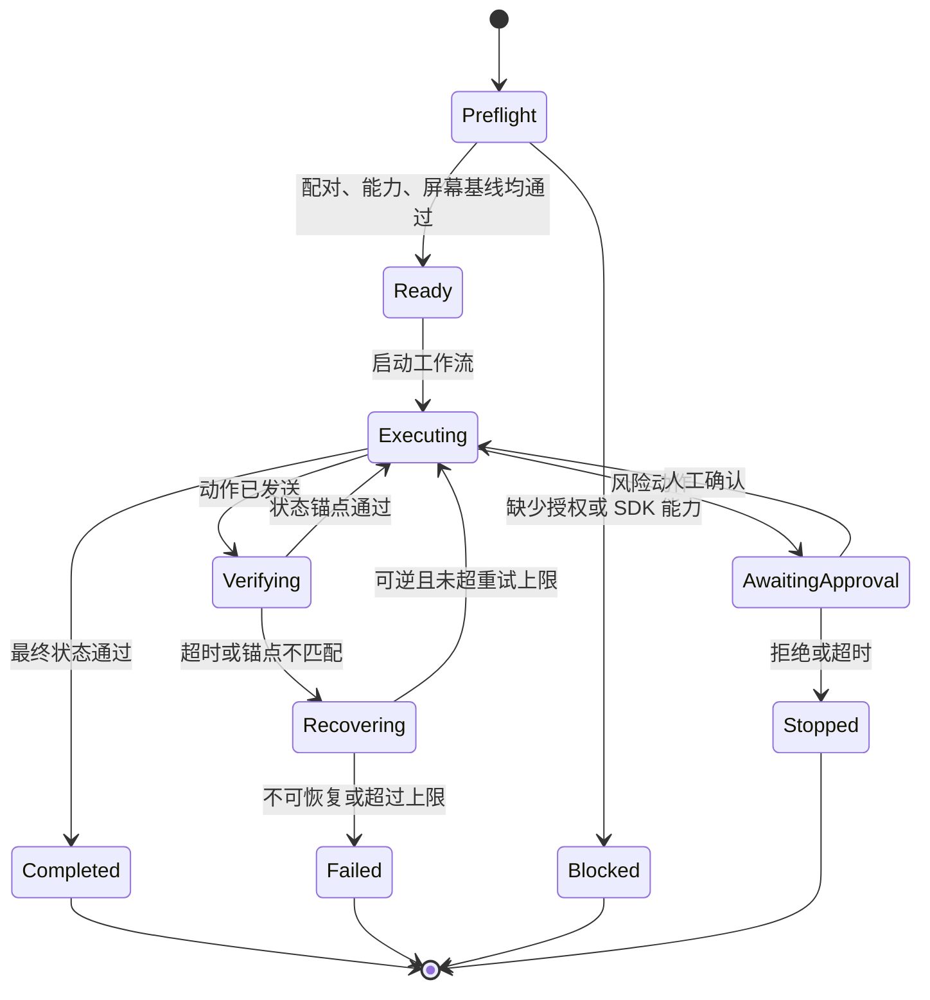

# ESP32 HID 手机自动化设计

## 结论

本项目以 ESP32 作为手机的蓝牙 HID 外设，由运行在手机 Cheese 环境中的脚本，通过本机 `localhost:8080/ble/...` 控制接口发送键盘和坐标触控输入，驱动已授权的手机 UI。首个版本只实现可配置、可观察、可安全停止的单设备 UI 自动化链路；不访问手机私有数据、不注入应用、不调用或伪造第三方私有协议。

> **接口依据。** 本设计以 [Cheese 蓝牙 HID 文档](../cheese-docs/hid_api/bt.md) 为准。文档给出了设备、鼠标和键盘的本机 HTTP 接口，以及 Cheese 插件和 Rhino 的等价调用方式。文档未定义超时、并发、节流和字符集边界，首期实现必须把这些限制配置化并通过实机测试确定。

## 目标与边界

目标：在一台受控手机上，以 ESP32 HID 完成已定义的 UI 操作序列，并对每一步保留可诊断证据。

范围内：

- Android 或 iOS 已配对设备上的点击、滑动、按键、文本输入和等待。
- 通过屏幕投送、人工观察或项目方授权的页面状态源进行结果确认。
- 单设备串行执行、限次重试、紧急停止和运行日志。

范围外：

- 绕过锁屏、验证码、风控、权限弹窗或应用安全机制。
- 获取账号凭据、Cookie、设备标识或非项目数据。
- 批量不可逆操作；提交、支付、删除等动作默认要求人工确认。
- 反向分析、修改或调用微信及其他第三方应用的私有协议。

## 前置条件

| 项目 | 要求 |
| --- | --- |
| ESP32 | 已烧录并验证可被手机识别为目标 HID 类型 |
| 手机 | 专用测试机或已获书面授权的受控设备，已完成配对和必要登录 |
| UI 基线 | 固定分辨率、方向、显示缩放、主题和目标应用版本 |
| 观察通道 | 可见屏幕投送或其他获授权的只读状态验证方式 |
| Cheese 运行环境 | 手机已安装并启动 Cheese，允许必要权限；脚本可访问本机 `localhost:8080` |
| ESP32 蓝牙 HID | 已完成配对；可通过 `GET /ble/device/connect` 和 `GET /ble/device/state` 连接并取得固件版本 |
| 编排主机 | 负责下发工作流、收集脱敏事件和人工确认；不直接连接或控制 ESP32 |

## 总体架构



### 模块职责

| 模块 | 职责 | 不负责 |
| --- | --- | --- |
| `workflow` | 解析动作、状态、超时和允许迁移 | 直接调用 SDK |
| `orchestrator` | 串行调度、检查点、重试与停止 | 判断屏幕业务语义 |
| `hid_adapter` | 将通用动作转换为 Cheese 本机 HTTP 或插件调用 | 业务决策与坐标猜测 |
| `state_verifier` | 基于授权的屏幕/页面锚点确认状态 | 绕过验证码或安全弹窗 |
| `safety_gate` | 风险动作二次确认、速率限制、设备白名单 | 自动批准风险操作 |
| `artifacts` | 结构化事件、截图引用、错误与耗时归档 | 保存凭据或敏感正文 |

## 动作模型

上层动作使用与 SDK 无关的 JSON 表示。所有坐标都使用 0 到 1 的屏幕相对坐标；执行前由设备配置转换为像素，避免将绝对坐标散布在流程中。

```json
{
  "workflow_id": "example-checkin",
  "device_id": "test-phone-01",
  "screen": { "width": 1170, "height": 2532, "orientation": "portrait" },
  "steps": [
    { "id": "open", "type": "tap", "x": 0.50, "y": 0.74, "expect": "home_ready" },
    { "id": "find", "type": "wait_for", "state": "target_visible", "timeout_seconds": 15 },
    { "id": "scroll", "type": "swipe", "from": [0.50, 0.78], "to": [0.50, 0.30], "duration_ms": 450 },
    { "id": "submit", "type": "tap", "x": 0.82, "y": 0.91, "requires_confirmation": true }
  ]
}
```

支持的首期动作：`tap`、`swipe`、`key`、`text`、`wait`、`wait_for`、`checkpoint`、`stop`。Cheese 文档提供了 `keyboard/print?text=...`；首期仍只允许经字符集实测的文本，不能假设该接口支持 Unicode、输入法候选或任意 URL 编码文本。

## 执行状态机



每个会改变 UI 的动作必须具有动作前状态、发送记录、动作后期望状态和超时。只发送 HID 报文不能视为业务成功。

## Cheese 蓝牙 HID 接口契约

所有端点均为运行脚本的手机本机服务，首期统一使用 `GET`。成功响应形如 `{"code":200,"msg":"成功","data":true}`；连接和重启失败的文档示例为 `null`，适配器必须将空响应、非 200 代码、无法解析的 JSON 和 `data != true` 统一转换为可分类的传输错误。

| 编排动作 | Cheese HTTP 端点 | 约束 |
| --- | --- | --- |
| 连接默认设备 | `/ble/device/connect` | 运行前必须成功 |
| 按 MAC 连接 | `/ble/device/macConnect?mac=<mac>` | `mac` 仅来自设备白名单 |
| 固件状态 | `/ble/device/state` | 返回 `data` 为固件版本；作为预检与故障诊断证据 |
| 重启 | `/ble/device/restart` | 仅在人工批准的恢复策略中使用 |
| 点击 | `/ble/mouse/click?x=<px>&y=<px>` | 传入基于当前屏幕的像素坐标 |
| 手势拆分 | `/ble/mouse/down`、`/move`、`/up` | 异常路径必须调用 `up` |
| 普通滑动 | `/ble/mouse/swipe?x=&y=&ex=&ey=` | 使用文档默认轨迹 |
| 受控滑动 | `/ble/mouse/swipe1?x=&y=&ex=&ey=&s=<steps>&d=<ms>` | `s`、`d` 均由工作流限制范围 |
| 长按与释放 | `/ble/mouse/press?x=&y=`、`/ble/mouse/release` | 释放动作必须进入 finally 清理 |
| 系统键 | `/ble/keyboard/{back,home,recent,enter}` | 仅允许白名单键名 |
| 文本与按键 | `/ble/keyboard/print?text=`、`/write?key=`、`/press?key=` | 文本 URL 编码；按键长按后必须释放 |
| 剪贴板组合键 | `/ble/keyboard/{copy,paste}` | 视为风险动作，不读取或记录剪贴板内容 |
| 键盘释放 | `/ble/keyboard/release` | 每次执行结束、异常和停止时调用 |

**实现选择：**第一阶段使用本机 HTTP 适配器，避免在业务代码中耦合 Java 类加载；若后续需要减少 HTTP 往返，可新增 Cheese 插件适配器，但它必须实现相同接口并通过同一套契约测试。

## SDK 核验清单

实施前，以 ESP32 和测试手机完成以下项目并记录 SDK 版本、调用示例和结果：

| 核验项 | 验收标准 | 对实现的影响 |
| --- | --- | --- |
| 连接生命周期 | `connect` 成功后，`state` 返回预期固件版本 | 定义连接与健康检查；文档未提供 disconnect，不伪造该操作 |
| HID 类型 | 文档接口可完成 `click`、`down/move/up`、`swipe1` 和键盘操作 | 首期确认具备坐标触控与键盘能力 |
| 指针绝对定位 | 坐标以当前屏幕像素传入，实测屏幕四角和状态栏偏移 | 建立归一化坐标到像素的映射 |
| 按下与释放 | 可发送 press、move、release 且顺序可靠 | `swipe` 适配器实现依据 |
| 文本输入 | `keyboard/print` 对 ASCII、中文、符号、换行和焦点切换的实测结果 | 决定 `text` 能力与 URL 编码规则 |
| 报告节流 | 最小安全间隔、队列容量和错误码 | 配置速率限制和重试条件 |
| 设备身份 | 可读取的设备 ID、固件版本与配对状态 | 白名单和审计字段 |
| 断连恢复 | 断连后是否需要重新配对、重连语义 | 恢复策略与人工介入边界 |

若 SDK 只提供键盘 HID，而未提供可用的绝对指针或触摸模拟，本方案首期只能覆盖键盘可达流程；不得以坐标动作替代未验证的能力。

## HID 适配器接口

实现时将 SDK 隔离在唯一适配器中，业务层不引用 SDK 类型：

```text
connect() -> FirmwareVersion
connect_by_mac(mac) -> FirmwareVersion
get_firmware_state() -> FirmwareVersion
tap(normalized_x, normalized_y)
swipe(start, end, duration_ms)
send_key(key)
send_text(value)
get_health() -> DeviceHealth
release_all()
restart_after_approval()
```

`DeviceCapabilities` 必须显式包含 `absolute_pointer`、`swipe`、`unicode_text` 和 `max_reports_per_second`。其中前三项由接口文档和实测共同确定，最后一项由压测确定。编排器在运行前校验动作所需能力，缺少能力时进入 `Blocked`，而不是在中途降级执行。

## 安全与可靠性

- `release_all()` 在正常结束、异常、超时和人工停止时均执行：依次调用 `/ble/mouse/release` 与 `/ble/keyboard/release`，防止指针或按键保持按下。
- 仅允许配置中的 MAC 和固件版本范围；设备替换后必须重新预检。不会采集 IMEI、OAID、剪贴板或位置等 Cheese 设备 API 数据。
- 点击和滑动前后均记录时间戳、规范化坐标、设备状态、工作流步骤 ID 与验证结果；日志不得记录账号、文本输入内容或截图原图中的敏感信息。
- 动作速率由设备能力和配置双重限制；超出阈值立即停止，而非堆积 HID 报文。
- `submit`、`pay`、`delete` 等风险步骤通过 `requires_confirmation` 强制人工批准。
- 任何验证码、锁屏、系统权限授权或未知弹窗均进入 `Blocked`，保留证据后停止。

## 目录建议

```text
07wx-xcxauto/
  docs/
  src/wx_hid_auto/
    workflow/            # DSL、状态机与编排器
    devices/             # HID 抽象与 SDK 适配器
    verification/        # 授权状态验证接口
    observability/       # 事件、脱敏与证据索引
  configs/
  tests/
  artifacts/             # 本地忽略，不提交
```

## 分阶段实施与验收

1. **设备打通**：完成 Cheese 接口核验清单，形成受版本控制的能力测试；验收为 20 次 `connect`/`state`、输入和双重 release 循环无残留按键或触摸状态。
2. **输入原语**：实现适配器和模拟设备测试；验收为 `tap`、`swipe`、按键、异常 `release_all` 的可重复测试。
3. **工作流闭环**：实现 DSL、状态机、风险确认、运行归档；验收为目标测试流程连续 20 次运行，每一步均有状态证据。
4. **异常回归**：注入断连、界面变化、未知弹窗和验证超时；验收为限次恢复或安全停止，且不会重复执行风险步骤。

## 开工门槛

在以下信息确认后进入编码：

1. ESP32 固件/设备型号、蓝牙 MAC、手机平台与目标系统版本。
2. `connect`、`state`、`click`、`swipe1`、`print` 和 release 的实机测试结果，以及目标屏幕的坐标偏移基线。
3. 首个自动化流程、允许操作范围、成功锚点和需要人工确认的动作。
4. 可用的、经过授权的状态验证方式。
