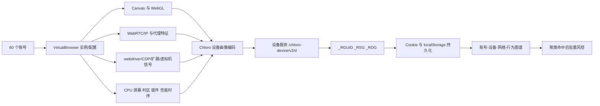

# 携程酒店网页设备指纹与跨账号关联分析报告

> 分析日期：2026-08-21  
> 分析方式：离线静态逆向（未登录页面快照）  
> 样本目录：`05ctrip-js-reverse/js_未登录状态`  
> 结论置信度：高（存在采集与上报闭环）；中高（对本次 60 账号事件的具体归因）

## 执行摘要

结论不是“携程仅靠 Canvas 锁定了账号”，而是：样本中存在完整的多维设备识别和机器人检测体系，Canvas 只是其中一项。代码会采集 Canvas、WebGL、WebRTC/IP、CPU、插件、屏幕、时区、浏览器属性、性能时序与自动化信号，上报至设备服务，并取得长期设备标识 `_RGUID`、`_RSG`、`_RDG`。另有 `GUID`、`c-sec-uuid`、`MKT_CKID` 等持久标识，以及 Playwright/WebDriver、软件渲染器、虚拟机 GPU、特定指纹浏览器扩展探测。

新增的 VirtualBrowser 导出文件包含 25 个被封配置。虽然 25 个配置的 Canvas 参数、WebGL renderer、Audio 参数和 `_RGUID/GUID/UBT_VID` 都已分别随机化或隔离，但 20 个配置两两复用了完全相同的代理 host、port 和代理账号，共形成 10 个直接网络配对组；23 个配置还共享同一个 32 位十六进制 `_udl` Cookie 值。该数据显著增强了“多因素图谱聚类后批量处置”的判断，也进一步削弱了“Canvas 单点导致全封”的假设。

## Scope 摘要

- Scope：[scope.md](../scope.md)
- 授权状态：granted
- 网络模式：offline
- 范围：用户提供的本地 HTML/JS 快照
- 未执行：登录、线上请求重放、账号操作、风控绕过

## 核心证据

| Evidence | 文件 | 关键事实 |
|---|---|---|
| E-001 | `d.min.aa836653.js.下载` | 设备画像采集、压缩、POST 至 `cdid.c-ctrip.com/chloro-device/v2/d`，写回 `_RGUID/_RSG/_RDG` |
| E-002 | `c-sec.js.下载` | Canvas/WebGL/WebRTC、自动化完整性检查、AdsPower/huayoung 扩展痕迹、GUID/USERINFO 读取 |
| E-003 | `foundation.js.下载` | Playwright/WebDriver、软件 renderer、虚拟机 GPU 等 Bot 检测，并上报 `botReasons` |
| E-004 | `collect.js.下载` | `MKT_CKID` 长期写 cookie/localStorage，并进入 UBT 业务追踪 |
| E-005 | `Virtual-Browser_0821_全量封号.json` | 25 个被封配置的字段唯一性、代理复用组与 Cookie 关联统计 |

关键样本 SHA-256 与字节位置：

- `d.min.aa836653.js.下载`：`632DEA...0158`；设备接口 offset 502，`webdriverCheck` offset 37760，`webglFp` offset 50060，`canvasData` offset 54004。
- `c-sec.js.下载`：`E82F00...5A86`；扩展检测 offset 9696，AdsPower 痕迹 offset 9873，GUID offset 13434。
- `foundation.js.下载`：`3C0AAF...2BF3`；Playwright offset 14343，`openCheckBot` offset 16058。

## Findings

### F-001：多维设备画像可形成稳定跨账号关联

- severity: n/a_re
- category: reverse_algo
- status: validated
- evidence_ids: [E-001, E-004]
- location: `d.min.aa836653.js.下载`、`collect.js.下载`
- confidence: high
- impact: 同一浏览器环境中切换账号，并不会切断设备层关联；设备标识、渲染指纹与网络/环境特征可跨会话持续存在。

### F-002：Canvas 确实参与，但不是单点定责依据

- severity: n/a_re
- category: reverse_algo
- status: validated
- evidence_ids: [E-001, E-002]
- location: `d.min.aa836653.js.下载`、`c-sec.js.下载`
- confidence: high
- impact: Canvas 结果与 WebGL renderer、扩展列表、CPU、屏幕、时区、WebRTC/IP 等一起编码。只改变 Canvas 无法消除其余关联信号，且不一致的伪装本身可能成为异常。

### F-003：VirtualBrowser/自动化环境存在独立检测面

- severity: n/a_re
- category: design
- status: validated
- evidence_ids: [E-002, E-003]
- location: `c-sec.js.下载`、`foundation.js.下载`
- confidence: high
- impact: 即便各账号拥有不同 Canvas，`navigator.webdriver`、Playwright/CDP 痕迹、函数被重写、软件 WebGL、虚拟机 GPU、指纹浏览器扩展 DOM/CSS 痕迹仍可标记为 Bot。

### F-004：本次 60 账号批量风控最可能是多因素聚类后统一处置

- severity: n/a_re
- category: other
- status: candidate
- evidence_ids: [E-001, E-002, E-003, E-004]
- location: 服务端策略（本地样本不可见）
- confidence: medium
- impact: 账号使用 2—20 天、酒店数量不同并不能排除关联；共同设备、出口网络与自动化行为是更强的聚类边。

### F-005：20/25 配置存在明确的代理 endpoint 两两复用

- severity: n/a_re
- category: other
- status: validated
- evidence_ids: [E-005]
- location: `Virtual-Browser_0821_全量封号.json` → `proxy`
- confidence: high
- impact: 10 个 SOCKS5 endpoint 的 host、port、user 完全相同，每个被两个配置复用。即使浏览器指纹被随机化，服务端仍可通过同一出口网络把账号建立强关联。

### F-006：23/25 配置共享相同 `_udl` 值

- severity: n/a_re
- category: other
- status: candidate
- evidence_ids: [E-005]
- location: `Virtual-Browser_0821_全量封号.json` → `cookieData[name=_udl]`
- confidence: medium
- impact: 该值是相同的 32 位十六进制字符串，重复率异常高；但在未还原 `_udl` 的业务语义前，不能判断它是用户关联标识还是公共默认值。

## VirtualBrowser 导出数据统计

| 维度 | 结果 | 判断 |
|---|---:|---|
| 配置数 | 25 | 本文件不是完整 60 个配置 |
| `_RGUID/GUID/UBT_VID` | 各 25 个唯一值 | 没有直接复制同一设备 Cookie |
| Canvas RGBA | 25 个唯一组合 | 已做逐配置随机化 |
| WebGL renderer | 25 个唯一值 | 已做逐配置随机化 |
| Audio / ClientRects | 各 25 个唯一组合 | 已做逐配置随机化 |
| 代理 host:port:user | 15 个唯一值 | 10 组重复，覆盖 20 个配置 |
| 时区 | 25 个均为 `Asia/Hong_Kong` | 高度模板化 |
| 语言 | 20 个 zh-CN、5 个 ja | 仅两组模板 |
| 屏幕 | 20 个 1536×864、5 个 2560×1440 | 仅两组模板 |
| WebGL vendor | Intel 10、NVIDIA 10、AMD 5 | 仅三组模板 |
| `_udl` | 23 个存在且完全相同 | 需继续确认语义 |

这说明 VirtualBrowser 主要随机化了连续数值和设备名称，却保留了明显的群体模板结构。反风控不需要找到两个完全相同的完整指纹；它可以在“相同代理 + 相同时区 + 相同语言/屏幕模板 + 相似内核 + 相似行为”上建立聚类。

## 采集与关联路径



### P-001

- path_type: callflow
- start: 酒店页面加载
- goal: 服务端建立可复用设备关联
- steps:
  1. `d.min` 采集浏览器、渲染、网络与自动化字段（E-001）。
  2. 画像经静态/动态编码及压缩后提交设备服务（E-001）。
  3. 服务端返回设备标识并长期写入 cookie/localStorage（E-001）。
  4. UBT/WebCore 携带 Bot 原因和长期业务标识继续上报（E-003、E-004）。
  5. 服务端可把多个账号归并为共享设备或自动化集群（F-004，推断）。
- residual_risks: 服务端模型、权重、批量处置阈值不在前端样本中，不能从 JS 单独证明是哪一项最终触发。

## 为什么会“一次全部风控”

按可能性排序：

1. **共同网络身份（已有直接证据）**：20/25 配置两两复用相同 SOCKS5 host、port 和账号；这足以形成十组账号关联边。
2. **群体模板明显**：全部使用 Asia/Hong_Kong、SOCKS5、DNT=0、gpu=1 和空 launchArgs；语言、屏幕、vendor 只有少数固定组合。
3. **持久标识未完全隔离**：`_RGUID/_RSG/_RDG/GUID/MKT_CKID/c-sec-uuid` 在配置目录、cookie 或 localStorage 间复用。
4. **自动化/指纹浏览器痕迹**：webdriver、Playwright/CDP、原生函数被改写、软件 renderer、虚拟机 GPU、扩展注入 DOM/CSS 特征。
5. **行为图谱**：同一时间段批量登录、相似查询间隔、相同酒店池、固定路径、无正常用户交互、全天运行等。

账号运行天数和监控酒店数不同，只降低“完全相同行为模板”的相似度，不会消除上述设备与网络强关联。风控系统还可能先积累证据，达到集群置信度后统一处置，因此“同时被封”不代表“同时首次被识别”。

## 对所引文章的判断

文章关于 Canvas、WebGL、WebRTC、Audio、字体和自动化痕迹属于常见指纹维度，其“多个实例共享同一指纹会形成集群”与本样本证据方向一致。但文章对某项目的具体补丁数量、实现文件和效果属于二手描述，不能替代目标站代码证据。本报告的结论独立来自本地携程样本。

## 防御性排查建议

不要先假设 Canvas 是唯一原因。建议在不继续触发账号操作的前提下，导出每个 VirtualBrowser 配置的以下数据并做 60×字段差异矩阵：

- Cookie/localStorage：`_RGUID`、`_RSG`、`_RDG`、`GUID`、`MKT_CKID`、`c-sec-uuid`。
- Canvas/WebGL：Canvas hash、WebGL vendor/renderer、unmasked renderer、扩展与精度参数。
- 环境：UA/UA-CH、语言、时区、屏幕、DPR、CPU、插件、字体、AudioContext。
- 自动化：`navigator.webdriver`、Playwright/CDP 全局变量、原生函数 `toString()`、扩展注入节点。
- 网络：出口 IP、ASN、地区、DNS、WebRTC candidate、代理与时区/语言一致性。
- 行为：启动时间、登录时间、查询间隔、酒店重合度、请求并发和失败重试模式。

本文件已经显示代理 endpoint 是跨配置完全相同的强关联字段。Canvas、WebGL renderer 与 `_RGUID` 虽然各自唯一，并不足以抵消这条网络关联及其他群体模板特征。

## 局限

- 样本是未登录状态快照，没有 60 个账号当时的请求日志、cookie、VirtualBrowser 配置和风控响应。
- 当前 VirtualBrowser JSON 只有 25 个配置；要解释全部账号，需要其余配置或确认该文件是否只导出了一个批次。
- 静态代码能证明“具备采集、上报和标记能力”，不能读取服务端模型权重，也不能证明最终处罚规则。
- `c-sec.js` 中部分高级指纹分支受运行时开关控制；但 `d.min` 的 Chloro 画像采集与设备服务提交链本身是直接证据。

## 可复现命令

```powershell
rg -n -i "chloro-device/v2/d|canvasData|webglFp|webdriverCheck|_RGUID|_RSG|_RDG" "05ctrip-js-reverse\js_未登录状态"
rg -n -i "genCanvasFP|UNMASKED_RENDERER_WEBGL|RTCPeerConnection|webdriver|AdsPower-find_selector|huayoung-userInfo|GUID|USERINFO|c-sec-uuid" "05ctrip-js-reverse\js_未登录状态"
rg -n -i "openCheckBot|Playwright|WebDriver|botReasons|isBotFeat|WebGL-strange-renderer|virtualbox|vmware" "05ctrip-js-reverse\js_未登录状态"
```

## Timeline 摘要

- 初始化离线分析 scope，路由至 `js-reverse`。
- 对本地 HTML/JS 进行关键词收敛和哈希去重。
- 定位 Chloro 设备采集/上报链、c-sec 指纹与扩展检测、WebCore Bot 原因上报。
- 建立 Evidence → Finding → Path，并输出本报告。
- 追加分析 25 个被封 VirtualBrowser 配置，验证代理复用、Cookie 唯一性和模板化程度。

完整记录：[timeline.md](../timeline.md)
